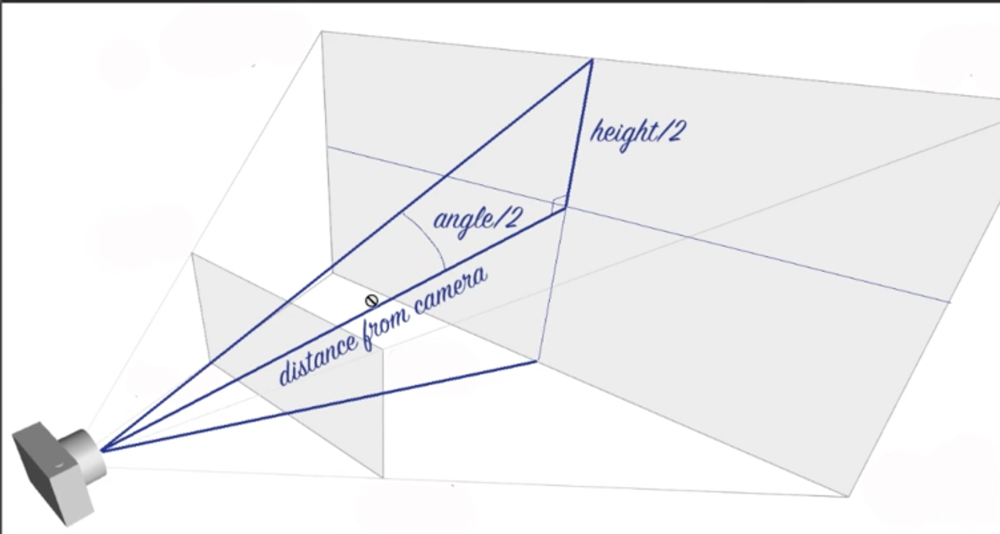

# merging-threejs-html


## Merge sizes of html & threejs 



```js
this.camera.fov = 2*Math.atan((window.innerHeight/2) / dist) * (180/Math.PI);
```
2 => 2 times the half height to get the real browser height
atan => get the tangent value of window.innerheight/2 divided by the camera dist from the object
*(100/Math.PI) => convert gradient to degrees

## Merge position & texture
first get the images & the information about position
```js
export default class Sketch {
    ...
    this.images = [...document.querySelectorAll('img')];
    ...
}


  addImages(){
    this.imageStore = this.images.map(img =>{
        let bounds = img.getBoundingClientRect();
        console.log(bounds);

        return {
          img: img,
          top: bounds.top,
          left: bounds.left,
          width: bounds.width,
          height: bounds.height
        }
    })
  }
```

This gives for each images

```
DOMRect {x: 712.5, y: 555.296875, width: 600, height: 400, top: 555.296875, …}
bottom: 955.296875
height: 400
left: 712.5
right: 1312.5
top: 555.296875
width: 600
x: 712.5
y: 555.296875
``` 

With those data, we create the actual 3D object
```js
  addImages(){
    this.imageStore = this.images.map(img =>{
        let bounds = img.getBoundingClientRect();
        console.log(bounds);

        let geometry = new THREE.PlaneBufferGeometry(bounds.width, bounds.height, 1, 1);
        let material = new THREE.MeshBasicMaterial({color: 0xff0000})

        let mesh = new THREE.Mesh(geometry, material);

        this.scene.add(mesh);

        return {
          img: img,
          mesh,
          top: bounds.top,
          left: bounds.left,
          width: bounds.width,
          height: bounds.height
        }
    })
  }
  ```

  Coordonate system of the html browser is from the top left to the bottom right when the threejs begins at the center of the image in all direction, so we will need to convert the threejs position to stick to the html pos.

  ```js
  setPositions(){
    this.imageStore.forEach(o =>{
      o.mesh.position.y = -o.top + this.height / 2 - o.height / 2;
      o.mesh.position.x = o.left - this.width / 2 + o.width/2;
    })
  }
  ```

  We will use 2 lib to wait for the images to load and the fontface. 

```js
import FontFaceObserver from 'fontfaceobserver';
import imagesLoaded from 'imagesloaded';


...

export default class Sketch{
    ...
    const fontOpen = new Promise(resolve => {
        new FontFaceObserver("Open Sans").load().then(() => {
        resolve();
        });
    });

    const fontPlayfair = new Promise(resolve => {
        new FontFaceObserver("Playfair Display").load().then(() => {
        resolve();
        });
    });

    // Preload images
    const preloadImages = new Promise((resolve, reject) => {
        imagesLoaded(document.querySelectorAll("img"), { background: true }, resolve);
    });
    
    let allDone = [fontOpen,fontPlayfair,preloadImages]
    Promise.all(allDone).then(()=>{
        this.addImages();
        this.setPositions();
        this.addObjects();
        
        this.resize();
        this.render();
        this.setupResize();
        // this.settings();
    });
} 
```

Next we had the texture 
```js
addImages(){
    ...
    let texture = new THREE.Texture(img);
        texture.needsUpdate = true;
        let material = new THREE.MeshBasicMaterial({
          //color: 0xff0000, 
          map: texture
        })
    ...
}
```

## Last part : merge scroll

Use library such as locomotive to trigger the scroll & mock it. 

```js
...
let currentScroll = 0;
Promise.all(allDone).then(()=>{
    ...
        this.scroll = new Scroll();
        window.addEventListener('scroll', () =>{
        this.setPositions();
        });
    ...
});
...
setPositions(){
this.imageStore.forEach(o =>{
    o.mesh.position.y = this.currentScroll -o.top + this.height / 2 - o.height / 2;
    o.mesh.position.x = o.left - this.width / 2 + o.width/2;
})
}
...
render(){
    ...
    this.scroll.render();
    this.currentScroll = this.scroll.scrollToRender;
    this.setPositions();
    ...
}
...
```


## Mouse hover wave effect
Now that we have the images inside THREEJS we can had pretty much any effect via shaders.

We will use raycaster & the mouse position in order to deform the image. 

```js
this.raycaster = new THREE.Raycaster();
this.mouse = new THREE.Vector2();
```
We will create a mousemovement function handling the movement
```js
mouseMovement() {
  window.addEventListener('mousemove', (event) => {
    // calculate mouse position in normalized device coordinates
    // (-1 to +1) for both components
    this.mouse.x = (event.clientX / this.width) * 2 - 1;
    this.mouse.y = - (event.clientY / this.height) * 2 + 1;
    // update the picking ray with the camera and mouse position
    this.raycaster.setFromCamera(this.mouse, this.camera);

    // calculate objects intersecting the picking ray
    const intersects = this.raycaster.intersectObjects(this.scene.children);

    if (intersects.length > 0) {
      let obj = intersects[0].object;
      obj.material.uniforms.hover.value =  intersects[0].uv;
      console.log(intersects[0]);
    }
  }, false);
}
```

And lastly we will pass the image as a THREE.ShaderMaterial
```js
 addImages() {
    this.material = new THREE.ShaderMaterial({
      extensions: {
        derivatives: "#extension GL_OES_standard_derivatives : enable"
      },
      side: THREE.DoubleSide,
      uniforms: {
        time: { value: 0 },
        uImage: {value: 0},
        hover: {value: new THREE.Vector2(0.5, 0.5)},
        hoverState: {value: 0},
        resolution: { value: new THREE.Vector4() },
      },
      //wireframe: true,
      transparent: true,
      vertexShader: vertex,
      fragmentShader: fragment
    });

    this.materials = [];

    this.imageStore = this.images.map(img => {
      let bounds = img.getBoundingClientRect();
      console.log(bounds);

      let geometry = new THREE.PlaneBufferGeometry(bounds.width, bounds.height, 10, 10);
      let texture = new THREE.Texture(img);
      texture.needsUpdate = true;

      let material = this.material.clone();
      this.materials.push(material);
      material.uniforms.uImage.value = texture;

      // trigger the effect only on mouseenter
      img.addEventListener('mouseenter',()=>{
        gsap.to(material.uniforms.hoverState, {
          duration: 1,
          value: 1
        });
      });
      img.addEventListener('mouseout',()=>{
        gsap.to(material.uniforms.hoverState, {
          duration: 1,
          value: 0
        });
      });

      let mesh = new THREE.Mesh(geometry, material);

      this.scene.add(mesh);

      return {
        img: img,
        mesh,
        top: bounds.top,
        left: bounds.left,
        width: bounds.width,
        height: bounds.height
      }
    })
    //console.log(this.imageStore)
}
```

Do not forget to update the time in each materials images
```js
render(){
  ...
  // Update the time forEach material images
    this.materials.forEach(m=>{
      m.uniforms.time.value = this.time;
    });
  ...
}
```

Then we can play with it inside the shaders

Vertex:
```glsl
uniform vec2 hover;
varying vec2 vUv;
uniform float time;
varying float vNoise;
varying float distNoise;
uniform float hoverState;
void main() {

  vec3 newpos = position;
  float PI = 3.1415925;

  float dist = distance(uv, hover);
  vUv = uv;

  newpos.z += hoverState * 10.*sin(dist*10. + time);

  distNoise = hoverState*sin(dist*10. - time);
  gl_Position = projectionMatrix * modelViewMatrix * vec4( newpos, 1.0 );
}  
```

Fragment:
```glsl
varying float vNoise;
varying float distNoise;
uniform sampler2D uImage;
varying vec2 vUv;
uniform float time;
void main()	{

	vec2 newUV = vUv;
	gl_FragColor = vec4(vUv, 0., 1.);
	
	//vec4 textureImage = texture2D(uImage, newUV);

	//gl_FragColor = textureImage;
	gl_FragColor.rgb += 0.05*vec3(distNoise);
}
```


## PostProcessing effect
We will use threejs post-processing effects

```js
import { EffectComposer } from 'three/examples/jsm/postprocessing/EffectComposer.js';
import { RenderPass } from 'three/examples/jsm/postprocessing/RenderPass.js';
import { ShaderPass } from 'three/examples/jsm/postprocessing/ShaderPass.js';
import { UnrealBloomPass } from 'three/examples/jsm/postprocessing/UnrealBloomPass.js';
```

```js
composerPass(){
  this.composer = new EffectComposer(this.renderer);
  this.renderPass = new RenderPass(this.scene, this.camera);
  this.composer.addPass(this.renderPass);

  //custom shader pass
  var counter = 0.0;
  this.myEffect = {
    uniforms: {
      "tDiffuse": { value: null },
      "scrollSpeed": { value: null },
    },
    vertexShader: `
    varying vec2 vUv;
    void main() {
      vUv = uv;
      gl_Position = projectionMatrix 
        * modelViewMatrix 
        * vec4( position, 1.0 );
    }
    `,
    fragmentShader: `
    uniform sampler2D tDiffuse;
    varying vec2 vUv;
    uniform float scrollSpeed;
    void main(){
      vec2 newUV = vUv;
      float area = smoothstep(0.4,0.,vUv.y);
      area = pow(area,4.);
      newUV.x -= (vUv.x - 0.5)*0.1*area*scrollSpeed;
      gl_FragColor = texture2D( tDiffuse, newUV);
    //   gl_FragColor = vec4(area,0.,0.,1.);
    }
    `
  }

  this.customPass = new ShaderPass(this.myEffect);
  this.customPass.renderToScreen = true;

  this.composer.addPass(this.customPass);
}
```

Replace the current renderer by this one

```js
render(){
  ...
  // scrollSpeed added for the effect 
  this.customPass.uniforms.scrollSpeed.value = this.scroll.speedTarget;
  //this.renderer.render(this.scene, this.camera);
  this.composer.render()
  ...
}
```
